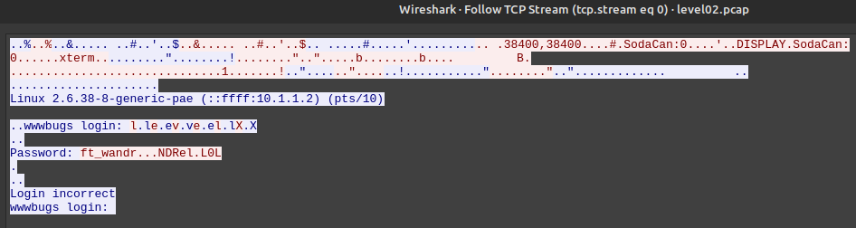

# Level02

## Walkthrough

By listing the files in the home directory, we find a `.pcap` file.

```bash
level02@SnowCrash:~$ ls -la
total 24
dr-x------ 1 level02 level02  120 Mar  5  2016 .
d--x--x--x 1 root    users    340 Aug 30  2015 ..
-r-x------ 1 level02 level02  220 Apr  3  2012 .bash_logout
-r-x------ 1 level02 level02 3518 Aug 30  2015 .bashrc
-r-x------ 1 level02 level02  675 Apr  3  2012 .profile
----r--r-- 1 flag02  level02 8302 Aug 30  2015 level02.pcap
```

A [pcap](https://en.wikipedia.org/wiki/Pcap) file is an API for capturing network traffic. It can be analyzed with tools like [Wireshark](https://www.wireshark.org) or [tshark](https://tshark.dev/).

To analyze the file, we transfer it to our local machine using SCP.

```bash
host:~$ scp -P 4242 level02@localhost:level02.pcap level02.pcap
```

After opening Wireshark, navigate to: `analyze → follow → TCP stream`.



Wireshark provides multiple ways to interpret captured data, including ASCII, UTF-8, and raw bytes. Initially the password extracted from ASCII and UTF-8 appeared incorrect due to extra or corrupted characters.

```
ASCII: ft_wandr...NDRel.L0L
UTF-8: ft_wandrNDRelL0L
```

To find the correct password, we manually translate the raw byte values to ASCII. The raw data was:
    
```
66 f
74 t
5f _
77 w
61 a
6e n
64 d
72 r
7f [DEL]
7f [DEL]
7f [DEL]
4e N
44 D
52 R
65 e
6c l
7f [DEL]
4c L
30 0
4c L
0d [end of transmission] 
```

The `7f [DEL]` character is a delete/backspace control character, meaning some characters were removed when the password was typed.

By removing these DEL characters, we reconstruct the actual password for `flag02`: ft_waNDReL0L.

```bash
level01@SnowCrash:~$ su flag02
Password: 
Don't forget to launch getflag !
flag01@SnowCrash:~$ getflag
Check flag.Here is your token : kooda2puivaav1idi4f57q8iq
```

## Resources

- [How to Use Wireshark: Comprehensive Tutorial + Tips](https://www.varonis.com/blog/how-to-use-wireshark#what-is-wireshark)
